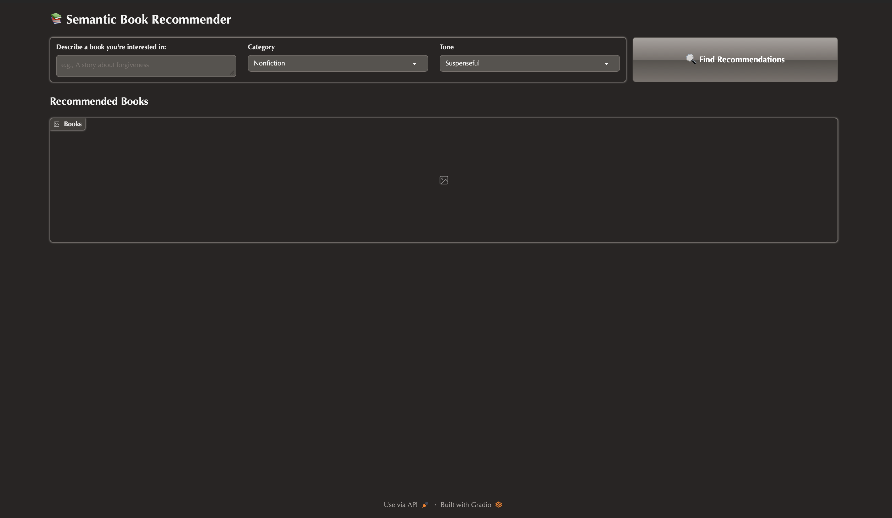

 📚 Semantic Book Recommender
A semantic, content-based book recommendation system that understands what you want to read and how you want the book to feel.
It uses modern text embeddings, a custom vector store, and tone-based filtering to deliver highly relevant book suggestions from natural-language queries.

🚀 Features
Semantic Search — powered by nomic-ai/nomic-embed-text-v1.5
Content-Based Filtering — matches books by meaning, not ratings
Custom Vector Database — fast ANN (approx. nearest neighbor) search
Tone/Mood Signals — optional emotion analysis for “feel-based” filtering
Interactive UI — Gradio interface for free-text queries and browsing results

📊 Dataset
Dataset: 7k Books with Metadata
Kaggle: https://www.kaggle.com/datasets/dylanjcastillo/7k-books-with-metadata
Processing includes:
Cleaning noisy or duplicate categories
Handling missing descriptions
Removing extremely short descriptions
Text normalization + embedding-ready preprocessing

🧠 Tech Stack
Python
Nomic Embeddings (nomic-embed-text-v1.5)
Custom Vector Store (ANN Search)
Pandas / NumPy
Gradio
Optional sentiment & tone extraction

🖥️ Installation
git clone https://github.com/rudramahajan25/Book-recommender-.git
cd Book-recommender-

Create a virtual environment (optional):
python3 -m venv venv
source venv/bin/activate   # Mac/Linux
venv\Scripts\activate      # Windows

Install dependencies:
pip install -r requirements.txt
▶️ Run the App
python dashboard.py
This will launch the Gradio Web UI in your browser
.
📸 Demo Media
🖼️ Screenshots

🎯 Inspiration & Credits
This project was inspired by:
📌 “LLM Course – Build a Semantic Book Recommender (Python, OpenAI, LangChain, Gradio)”
By Aleksa Gordić (AIshaman)
YouTube: https://youtu.be/Q7mS1VHm3Yw

Extended in this repository with:
Nomic embeddings instead of OpenAI
A custom-built vector database
Tone/emotion filtering
Enhanced preprocessing + curated metadata
